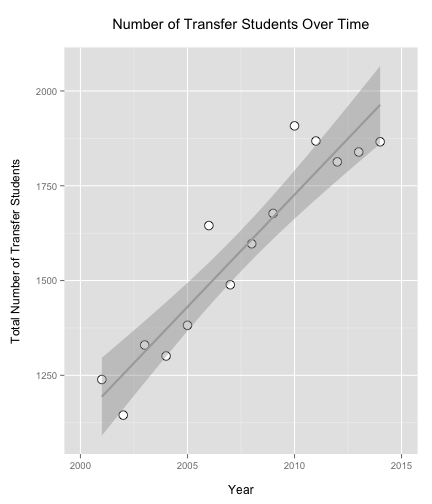

---
title       : Transfer Credit Trends
subtitle    : General Education at Ferris State University
author      : Dr. Clifton Franklund
job         : General Education Coordinator
framework   : io2012        # {io2012, html5slides, shower, dzslides, ...}
highlighter : highlight.js  # {highlight.js, prettify, highlight}
hitheme     : tomorrow      # 
widgets     : []            # {mathjax, quiz, bootstrap}
mode        : selfcontained # {standalone, draft}
knit        : slidify::knit2slides
logo        : icon.png
--- 
## Coursera Data Products Assignment

- This document explains the function of my Shiny app
- All of the tables and figures in these slides are generated using R
- This project was created to satisfy the project requirements for the Data Products course in the Coursera Data Science track

--- &twocol
## Background

*** =left

1. The number of transfer students is increasing at Ferris State University
2. More students are transferring General Education credits than before
3. The number of General Education courses is beginning to decrease as a consequence
4. We need to understand this phenomenon better in order to react constructively

*** =right

 

--- &twocol 
## Courses Evaluated

*** =left

1. The number top 20 courses for transfers were identified
2. 10 of these are core General Education courses
3. These 10 fell into five different programs
4. The actual numbers are shown to the right. Percent is the percentage of all transfer credits in this time period.

*** =right

<!-- html table generated in R 3.1.1 by xtable 1.7-4 package -->
<!-- Tue Jan 20 17:26:25 2015 -->
<table border=1>
<tr> <th>  </th> <th> Course </th> <th> Total </th> <th> Percent </th>  </tr>
  <tr> <td align="right"> 1 </td> <td> ENGL150 </td> <td align="right"> 34147.29 </td> <td align="right"> 3.35 </td> </tr>
  <tr> <td align="right"> 2 </td> <td> ENGL250 </td> <td align="right"> 27793.07 </td> <td align="right"> 2.73 </td> </tr>
  <tr> <td align="right"> 3 </td> <td> PSYC150 </td> <td align="right"> 25159.67 </td> <td align="right"> 2.47 </td> </tr>
  <tr> <td align="right"> 4 </td> <td> MATH115 </td> <td align="right"> 20859.94 </td> <td align="right"> 2.05 </td> </tr>
  <tr> <td align="right"> 5 </td> <td> MATH110 </td> <td align="right"> 17394.46 </td> <td align="right"> 1.71 </td> </tr>
  <tr> <td align="right"> 6 </td> <td> SOCY121 </td> <td align="right"> 15631.27 </td> <td align="right"> 1.54 </td> </tr>
  <tr> <td align="right"> 7 </td> <td> COMM121 </td> <td align="right"> 15532.91 </td> <td align="right"> 1.53 </td> </tr>
  <tr> <td align="right"> 8 </td> <td> PLSC121 </td> <td align="right"> 15199.37 </td> <td align="right"> 1.49 </td> </tr>
  <tr> <td align="right"> 9 </td> <td> BIOL103 </td> <td align="right"> 8465.97 </td> <td align="right"> 0.83 </td> </tr>
  <tr> <td align="right"> 10 </td> <td> COMM105 </td> <td align="right"> 8271.72 </td> <td align="right"> 0.81 </td> </tr>
   </table>

--- .class #id

## The Data Product in Action

<iframe src="http://franklund.shinyapps.io/shiny-transfers"></iframe>

